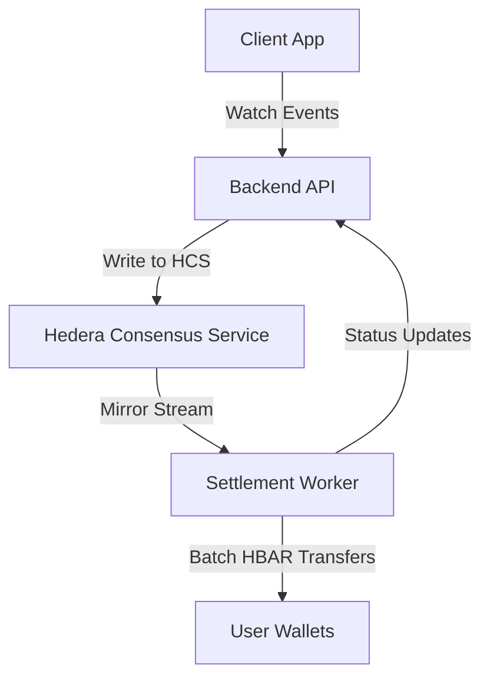
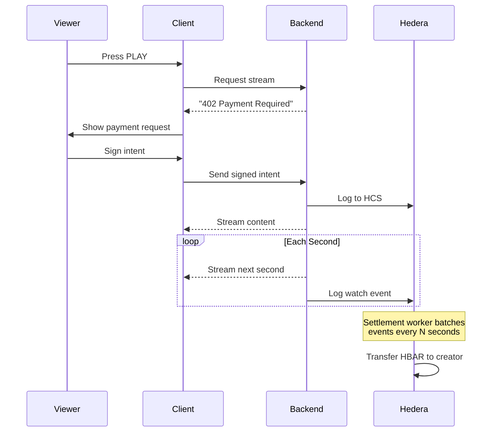

# 🚀 Hedera Micropayments Framework

## A Minimal, Open-Source Toolkit for Real-Time Micro-Transactions

**Imagine a streaming platform where every second of watch time automatically pays the creator, and viewers earn for watching ads.** This framework demonstrates how that's possible using Hedera's fast, low-cost blockchain.

This is **not a finished product**—it's a **starter kit** and **proof-of-concept** that shows how micro-payments can revolutionize digital monetization. Fork it, modify it, and build your own decentralized applications where value flows directly between users.

---

## 🎯 The Problem & Vision

Today's digital platforms have fundamental flaws:
- **Creators** lose 30-50% of revenue to platform fees
- **Payouts** take weeks or months
- **Viewers** provide attention but receive nothing
- **Innovation** is gated by closed APIs and centralized control

**This framework asks: What if we could rebuild just the payment layer?**

Using Hedera's blockchain, we enable:
- **Per-second payments** (fractions of a cent)
- **Instant settlements** (2-5 second finality)
- **Direct user-to-user transfers** (no middleman)
- **Transparent, auditable** revenue flows

---

## 🧱 What's in the Box?

### Core Components
1. **Payment Engine** - Handles micro-transactions using HBAR
2. **Hedera Consensus Service (HCS) Integration** - Immutable event logging
3. **x402 Payment Challenge** - HTTP-standard pay-to-access protocol
4. **Batch Settlement System** - Groups tiny payments for efficiency
5. **Demo Implementations** - Working examples to learn from

### Example Use Case: Streaming Platform
The framework includes a complete demo showing:
- **Per-second video streaming payments**
- **Ad rewards** (viewers earn for watching)
- **Ad skips** (viewers pay to skip)
- **Referral commissions**
- **Creator dashboard** with real-time analytics

---

## 🧬 Architecture Overview



**Key Design Principles:**
1. **Event-First Architecture** - All actions are logged to HCS first
2. **Decoupled Settlement** - Processing happens asynchronously
3. **Batch Optimization** - Tiny payments are grouped (1-10 second intervals)
4. **Graceful Degradation** - System works even if HCS is slow

---

## 🔁 How It Works: Key Flows

### 1. Pay-Per-Second Streaming


### 2. Ad-Reward Flow
Viewers earn micro-payments for engaging with ads:
```
Ad Starts → Event Logged to HCS → Settlement Worker → HBAR to Viewer
```

### 3. Referral Commission
Affiliates earn when referrals convert:
```
Link Click → HCS Log → First Payment → Commission Payout
```

**📊 Complete diagrams in `/docs/sequence-diagrams/`**

---

## ⚙️ Core Hedera Features Used

| Feature | Purpose | Why It Matters |
|---------|---------|----------------|
| **HCS** | Immutable event logging | Tamper-proof record of all actions |
| **HBAR Transfers** | Value movement | Sub-cent transactions possible |
| **Token Service** | Custom tokens (optional) | Platform-specific currencies |
| **Consensus** | Fast finality | 2-5 second settlement |

---

## 🚀 Quick Start

### 1. Clone & Setup
```bash
git clone https://github.com/your-username/hedera-micropayments-framework
cd hedera-micropayments-framework
cp .env.example .env
```

### 2. Configure Hedera
```bash
# Edit .env with your Testnet credentials
HEDERA_ACCOUNT_ID=0.0.xxxx
HEDERA_PRIVATE_KEY=302e...
HEDERA_NETWORK=testnet
```

### 3. Install & Run
```bash
npm install
npm run dev
```

### 4. Explore the Demos
- Open `http://localhost:3000` for the video player demo
- Check `http://localhost:3000/dashboard` for creator tools
- Monitor transactions at `hashscan.io`

---

## 📁 Repository Structure

```
hedera-micropayments-framework/
├── backend/                 # Core payment engine
│   ├── hcs/                # Hedera Consensus Service integration
│   ├── settlement/         # Batch payment processor
│   ├── x402/              # Payment challenge middleware
│   └── examples/           # Use case implementations
├── frontend/               # Demo applications
│   ├── video-player/       # Streaming demo
│   ├── dashboard/          # Creator interface
│   └── wallet-demo/        # Payment flow examples
├── docs/                   # Comprehensive documentation
│   ├── architecture.md
│   ├── sequence-diagrams/
│   ├── api-reference.md
│   └── whitepaper-draft.md
├── tests/                  # Test suites
└── scripts/               # Deployment & utility scripts
```

---

## 🕸️ How This Differs From Other Projects

Most "decentralized YouTube" attempts try to rebuild **everything**—storage, streaming, discovery. They often fail due to complexity.

**This framework takes a different approach:**

| | Traditional Approach | Our Approach |
|-|---------------------|--------------|
| **Scope** | Full platform replacement | Payment layer only |
| **Complexity** | High (storage+streaming+payments) | Focused (payments only) |
| **Adoption** | All-or-nothing | Plug into existing apps |
| **Innovation** | Single solution | Foundation for many solutions |

**We're building the "Stripe for micro-transactions"—not another platform.**

---

## 🤝 Contributing

We welcome contributions! This is an **open experiment** meant to grow through community input.

### Ways to Contribute:
1. **Fork & Build** - Create your own payment model
2. **Improve Core** - Optimize batch processing or HCS usage
3. **Add Examples** - New use cases (APIs, IoT, gaming)
4. **Document** - Better explanations, tutorials, diagrams
5. **Test & Report** - Find bugs, suggest improvements

See [CONTRIBUTING.md](./CONTRIBUTING.md) for guidelines.

---

## 🗺️ Roadmap & Future Directions

### Short-term (Community Contributions Welcome)
- [ ] Multi-token support (HTS integration)
- [ ] Advanced fraud detection
- [ ] React/Vue SDK packages
- [ ] More example implementations

### Long-term Vision
- **Plugin System** - Swap payment models easily
- **WASM Engine** - Portable payment logic
- **Cross-chain Bridges** - Beyond Hedera
- **Standard Protocol** - x402 extensions for micro-payments

---

## ❓ FAQ

**Q: Is this ready for production?**  
A: No—this is a **proof-of-concept**. Use it to learn, experiment, and build prototypes.

**Q: Do I need deep blockchain knowledge?**  
A: No! The framework abstracts complex Hedera interactions. Start with the examples.

**Q: Can I use this for non-video applications?**  
A: Absolutely! The payment engine is generic. Use it for APIs, games, IoT—anywhere micro-payments make sense.

**Q: What about gas fees?**  
A: Hedera transactions cost ~$0.0001, making sub-cent payments practical.

---

## 📜 License

MIT License - Use freely for any purpose. Attribution appreciated but not required.

---

## 🙏 Acknowledgements

Built to demonstrate Hedera's unique capabilities for micro-transactions. Inspired by the vision of an internet where value flows directly between participants, without unnecessary intermediaries.

**Special thanks to** the Hedera community, early testers, and everyone questioning why digital payments can't be faster, cheaper, and fairer.

---

## 🔗 Resources & Next Steps

- [Hedera Documentation](https://docs.hedera.com)
- [HashScan Explorer](https://hashscan.io) (view testnet transactions)
- [Discord Community](https://hedera.com/discord) (get help, share ideas)
- [Example Projects](./docs/examples.md) (more inspiration)

---

**Ready to build?** Start with the [video streaming example](./frontend/video-player/README.md) or [create your own payment model](./docs/creating-models.md).

*Questions? Issues? Ideas?* Open an issue or join the discussion!