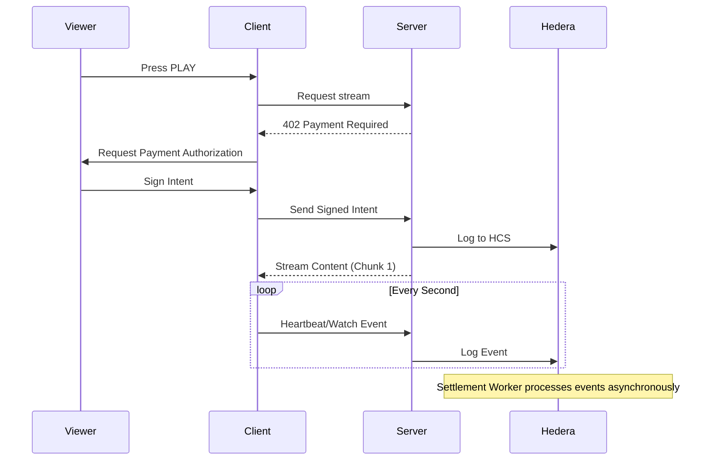

# Architecture Documentation

## System Architecture

```mermaid
graph TB
    Client[Client App (Frontend)] -->|Watch Events| Server[Server API]
    Server -->|Write to HCS| HCS[Hedera Consensus Service]
    HCS -->|Mirror Stream| Worker[Settlement Worker]
    Worker -->|Batch HBAR Transfers| Wallets[User Wallets]
    Worker -->|Status Updates| Server
    
    subgraph "Hedera Network"
    HCS
    end
    
    subgraph "Backend Infrastructure"
    Server
    Worker
    end
```

## Sequence Diagram: Payment Flow


